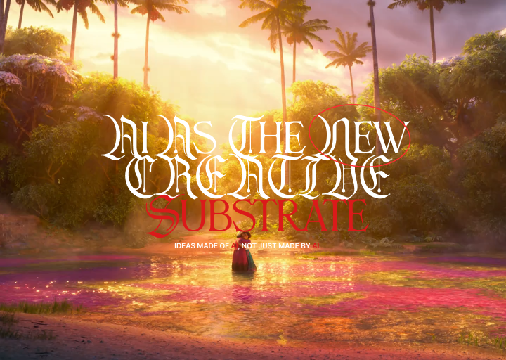

# Ernest Pascual Interactive Talks Web App

## Current available talks:

<div align="center">
  
  <br />
  <a href="https://talks.ernestpascual.com/talks/raw-school-2026">Raw School 2026</a>
</div>

## Getting Started

First, run the development server:

```bash
npm run dev
# or
yarn dev
# or
pnpm dev
# or
bun dev
```

Open [http://localhost:3000](http://localhost:3000) with your browser to see the result.

## Routes & features

| Route                    | File                         | Description                                                         |
| ------------------------ | ---------------------------- | ------------------------------------------------------------------- |
| `/admin`                 | `app/admin/`                 | Password-protected admin area (client-side auth via `localStorage`) |
| `/talk`                  | `app/talk/page.tsx`          | Index linking to talk decks                                         |
| `/talks/raw-school-2026` | `app/talks/raw-school-2026/` | **Raw School 2026** slide deck (14 slides)                          |
| `/experience`            | `app/experience/page.tsx`    | Experience page (placeholder content for now)                       |

Legacy URLs `/talk/raw-school-2026` and `/talk/raw-school-2026/:slide` redirect to `/talks/raw-school-2026/...`.

### Admin (`/admin`)

- Sign in with a fixed password (see [Changing the admin password](#changing-the-admin-password) below).
- Session is stored in `localStorage` under the key `admin-auth`.
- Sessions expire **7 days** after login; you must sign in again after that.
- Use the **Log out** button on the admin page, or call `logout()` from `lib/admin-auth.ts`.

Relevant files:

- `lib/admin-config.ts` — admin password constant (temp/no use yet)
- `lib/admin-auth.ts` — `login()`, `logout()`, `isAuthenticated()`
- `app/admin/AdminPage.tsx` — login form and protected UI

**Note:** Admin protection is client-side only. It is suitable for casual access control on a personal site, not for sensitive data.

### Raw School 2026 (`/talks/raw-school-2026`)

A fullscreen presentation on **AI as creative substrate**—how ideas can be made _of_ AI, not only _by_ AI. The deck uses Inter on a black background, with prev/next arrows (middle left/right) and a page number (upper right).

- **Entry:** `/talks/raw-school-2026` redirects to slide 1 (`/talks/raw-school-2026/1`).
- **Slides:** 14 pages at `/talks/raw-school-2026/[1–14]`.
- **Content:** `lib/talks/raw-school-2026/slides.ts` — edit titles, bullets, and slide kinds here.
- **Layout / components:** `app/talks/raw-school-2026/components/` — rendering per slide type (`SlideContent.tsx`).

| #   | What happens                                                                                                                                    |
| --- | ----------------------------------------------------------------------------------------------------------------------------------------------- |
| 1   | Title slide — full-screen `img/slide1.png` (text baked into artwork)                                                                            |
| 2   | Creative technologist artwork — `slide2bg.mp4` + `slide2.png`                                                                                   |
| 3   | Creativity × Technology (Venn diagram)                                                                                                          |
| 4   | Think in systems — `slide4.png` artwork                                                                                                         |
| 5   | Where AI comes in — `slide5.png` artwork                                                                                                        |
| 6   | **Smile pricing demo** — Php 100.00; smile tiers −0.50 / −1 / −1.50 / −2 per second (bigger smile = bigger cut); neutral +0.50/s; 10s countdown |
| 7   | Use of AI — `slide7.png` artwork                                                                                                                |
| 8   | Deterministic vs probabilistic — `slide8bg.mp4` + `slide8.png`                                                                                  |
| 9   | Fruit Ninja — hand-tracked slash game (one hand, asymmetric slices)                                                                             |
| 10  | AI idea DNA / Krebs cycle — `slide10.png` artwork                                                                                               |
| 11  | Framework — `slide11.png` artwork                                                                                                               |
| 12  | Polymath — `slide12.png` artwork                                                                                                                |
| 13  | Staying ethical and safe — `slide13bg.mp4` + `slide13.png`                                                                                      |
| 14  | Tolstoy quote — `slide14bg.mp4` + `slide14.png`                                                                                                 |

Slide 1 artwork lives in `app/talks/raw-school-2026/img/slide1.png`. Face tracking logic is in `lib/face-mesh/`.

### Experience

Placeholder copy lives in `app/experience/page.tsx`.

## Changing the admin password

1. Open `lib/admin-config.ts`.
2. Change the value of `ADMIN_PASSWORD`:

3. Save the file and restart the dev server if it is running.
4. Anyone already signed in keeps their session until it expires (7 days) or they log out. After a password change, old sessions still work until expiry—use **Log out** or clear `admin-auth` in browser `localStorage` if you need to force re-login immediately.

Default password before you change it: `change-me`.

## Learn More

To learn more about Next.js, take a look at the following resources:

- [Next.js Documentation](https://nextjs.org/docs) - learn about Next.js features and API.
- [Learn Next.js](https://nextjs.org/learn) - an interactive Next.js tutorial.

You can check out [the Next.js GitHub repository](https://github.com/vercel/next.js) - your feedback and contributions are welcome!

## Deploy on Vercel

The easiest way to deploy your Next.js app is to use the [Vercel Platform](https://vercel.com/new?utm_medium=default-template&filter=next.js&utm_source=create-next-app&utm_campaign=create-next-app-readme) from the creators of Next.js.

Check out our [Next.js deployment documentation](https://nextjs.org/docs/app/building-your-application/deploying) for more details.
